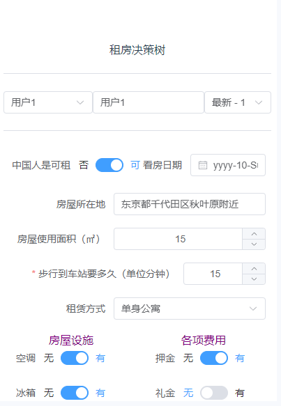

# rent-a-house

## Summary
A simple form application developed with the illusion of renting a house in Tokyo.
 

## Technology
FE: Vue3, Element-plus, VForm.
BE: Java Springboot, Mybatis, mysql, Redis.

## FE project setup
```
npm install
```

### Compiles and hot-reloads for development
```
npm run serve
```

### Compiles and minifies for production
```
npm run build
```

### Lints and fixes files
```
npm run lint
```

### Customize configuration
See [Configuration Reference](https://cli.vuejs.org/config/).

## BE project setup
First configure the remote server database and Redis service, and then modify the background configuration file.

```

idea run
```